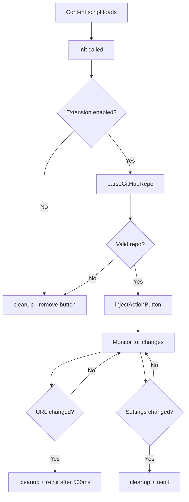

The content script (`content.js`) runs on all GitHub repository pages and injects the "View Docs on Mintlify" button into the repository header.

## Overview

The content script is injected at `document_idle` and:
- Parses the GitHub repository from the URL
- Injects an action button into the repository toolbar
- Listens for SPA navigation changes
- Responds to extension enable/disable settings

**Files**: `content/content.js` (99 lines) and `content/content.css` (37 lines)

## Constants

```javascript content.js
const MINTLIFY_BASE = "https://www.mintlify.com";
const ACTION_BTN_ID = "mintlify-action-btn";
```

<ParamField path="MINTLIFY_BASE" type="string">
  Base URL for Mintlify documentation pages
</ParamField>

<ParamField path="ACTION_BTN_ID" type="string">
  DOM element ID for the injected button (prevents duplicates)
</ParamField>

## Core functions

### parseGitHubRepo()

Extracts repository owner and name from the current GitHub URL.

```javascript content.js
function parseGitHubRepo() {
  const path = window.location.pathname.replace(/^//, "").replace(/\/$/, "");
  const segments = path.split("/");
  if (segments.length < 2) return null;

  const owner = segments[0];
  const repo = segments[1];

  const reserved = [
    "settings", "marketplace", "explore", "topics", "trending",
    "collections", "events", "sponsors", "login", "signup",
    "notifications", "new", "organizations", "features", "pricing",
  ];
  if (reserved.includes(owner)) return null;

  return { owner, repo, fullName: `${owner}/${repo}` };
}
```

<Accordion title="Return value">
  **Returns**: `{ owner, repo, fullName }` or `null`
  
  - `owner` - Repository owner username/organization
  - `repo` - Repository name
  - `fullName` - Combined `owner/repo` string
  - Returns `null` for invalid or reserved paths
</Accordion>

<Accordion title="Reserved owner names">
  The following GitHub paths are excluded because they're not repositories:
  
  ```javascript
  [
    "settings",
    "marketplace",
    "explore",
    "topics",
    "trending",
    "collections",
    "events",
    "sponsors",
    "login",
    "signup",
    "notifications",
    "new",
    "organizations",
    "features",
    "pricing"
  ]
  ```
</Accordion>

### getMintlifyUrl(owner, repo)

Constructs the Mintlify documentation URL for a repository.

```javascript content.js
function getMintlifyUrl(owner, repo) {
  return `${MINTLIFY_BASE}/${owner}/${repo}`;
}
```

<ParamField path="owner" type="string" required>
  Repository owner (username or organization)
</ParamField>

<ParamField path="repo" type="string" required>
  Repository name
</ParamField>

**Returns**: Full URL like `https://www.mintlify.com/owner/repo`

### injectActionButton(owner, repo)

Injects the "View Docs on Mintlify" button into the GitHub repository toolbar.

```javascript content.js
function injectActionButton(owner, repo) {
  if (document.getElementById(ACTION_BTN_ID)) return;

  const actionList = document.querySelector(
    'ul.pagehead-actions, .d-flex.gap-2 .d-flex, #repository-details-container ul'
  );

  if (!actionList) return;

  const li = document.createElement("li");
  li.style.display = "inline-block";
  li.id = ACTION_BTN_ID;

  const link = document.createElement("a");
  link.href = getMintlifyUrl(owner, repo);
  link.target = "_blank";
  link.rel = "noopener noreferrer";
  link.className = "mintlify-repo-action-btn";
  link.innerHTML = `
    <span>View Docs on Mintlify</span>
    <svg width="14" height="14" viewBox="0 0 24 24" fill="none" stroke="currentColor" stroke-width="2" stroke-linecap="round" stroke-linejoin="round">
      <path d="M18 13v6a2 2 0 0 1-2 2H5a2 2 0 0 1-2-2V8a2 2 0 0 1 2-2h6"/>
      <polyline points="15 3 21 3 21 9"/>
      <line x1="10" y1="14" x2="21" y2="3"/>
    </svg>
  `;

  li.appendChild(link);
  actionList.insertBefore(li, actionList.firstChild);
}
```

<Accordion title="DOM insertion strategy">
  The function tries multiple selectors to find the repository action toolbar:
  
  ```javascript
  'ul.pagehead-actions, .d-flex.gap-2 .d-flex, #repository-details-container ul'
  ```
  
  This ensures compatibility with different GitHub UI layouts. The button is inserted at the beginning of the action list (before Watch/Fork/Star buttons).
</Accordion>

<Accordion title="Button structure">
  Creates a link element with:
  - Class: `mintlify-repo-action-btn`
  - Target: `_blank` (opens in new tab)
  - Rel: `noopener noreferrer` (security best practice)
  - Contains: Text + external link SVG icon
</Accordion>

### cleanup()

Removes the injected button from the page.

```javascript content.js
function cleanup() {
  const actionBtn = document.getElementById(ACTION_BTN_ID);
  if (actionBtn) actionBtn.remove();
}
```

Called when:
- Extension is disabled
- User navigates away from a repository page
- Page is not a valid repository

### init()

Initializes the content script and conditionally injects the button.

```javascript content.js
function init() {
  chrome.storage.sync.get({ enabled: true }, (settings) => {
    if (!settings.enabled) {
      cleanup();
      return;
    }

    const info = parseGitHubRepo();
    if (!info) {
      cleanup();
      return;
    }

    injectActionButton(info.owner, info.repo);
  });
}
```

<Accordion title="Initialization flow">
  1. Checks `chrome.storage.sync` for `enabled` setting (defaults to `true`)
  2. If disabled, removes any existing button
  3. Parses current URL to extract repository info
  4. If not a valid repo page, removes any existing button
  5. Otherwise, injects the button into the page
</Accordion>

## MutationObserver (SPA navigation)

GitHub is a single-page application (SPA), so the content script uses a MutationObserver to detect URL changes without full page reloads.

```javascript content.js
let lastUrl = location.href;
const observer = new MutationObserver(() => {
  if (location.href !== lastUrl) {
    lastUrl = location.href;
    cleanup();
    setTimeout(init, 500);
  }
});
observer.observe(document.body, { childList: true, subtree: true });
```

<Accordion title="How it works">
  - Observes all DOM changes in `document.body`
  - When URL changes, removes old button and re-initializes after 500ms
  - The delay allows GitHub's SPA to finish rendering the new page
  - Monitors `childList` and `subtree` to catch all navigation events
</Accordion>

## Storage change listener

Responds to enable/disable toggle in the popup.

```javascript content.js
chrome.storage.onChanged.addListener(() => {
  cleanup();
  init();
});
```

When the user toggles the extension in the popup, this listener:
1. Removes the button from the page
2. Re-runs initialization (which checks the new `enabled` state)

## Button styles (content.css)

The injected button is styled to match GitHub's design system.

```css content.css
.mintlify-repo-action-btn {
  display: inline-flex;
  align-items: center;
  gap: 6px;
  padding: 3px 12px;
  height: 28px;
  background: #0D9373;
  color: #fff !important;
  border: 1px solid rgba(0, 0, 0, 0.15);
  border-radius: 6px;
  font-family: -apple-system, BlinkMacSystemFont, "Segoe UI", Helvetica, Arial, sans-serif;
  font-size: 12px;
  font-weight: 600;
  text-decoration: none !important;
  white-space: nowrap;
  cursor: pointer;
  line-height: 1;
  transition: background 0.15s ease;
  vertical-align: middle;
}

.mintlify-repo-action-btn:hover {
  background: #0b7d63;
  color: #fff !important;
  text-decoration: none !important;
}
```

<Accordion title="Design details">
  - **Color**: Mintlify green (`#0D9373`) with darker hover state (`#0b7d63`)
  - **Size**: 28px height to match GitHub's action buttons
  - **Typography**: System font stack matching GitHub
  - **Spacing**: 6px gap between text and icon
  - **Transitions**: 0.15s ease for smooth hover effect
</Accordion>

## Execution flow



## Related documentation

<CardGroup cols={2}>
  <Card title="Manifest configuration" icon="file-code" href="/reference/manifest">
    View content_scripts configuration
  </Card>
  <Card title="Popup interface" icon="window" href="/reference/popup-interface">
    Learn about the enable/disable toggle
  </Card>
</CardGroup>