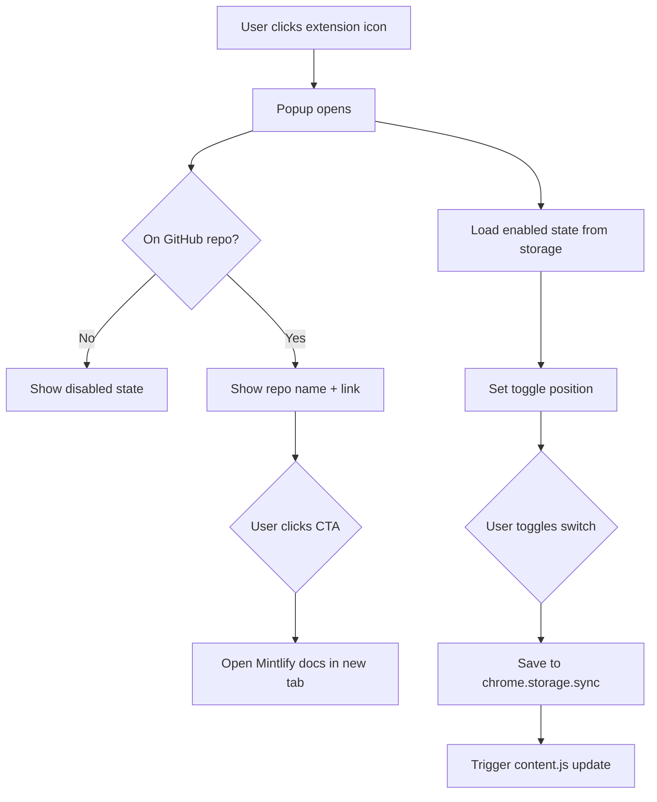

The popup interface appears when users click the extension icon in the Chrome toolbar. It provides a quick way to open documentation and toggle the extension on/off.

## Overview

The popup consists of three files:
- **popup.html** (44 lines) - Structure and markup
- **popup.js** (59 lines) - Functionality and tab detection
- **popup.css** (158 lines) - Styling and layout

**Dimensions**: 320px wide, auto height

## HTML structure (popup.html)

```html popup.html
<!DOCTYPE html>
<html lang="en">
<head>
  <meta charset="UTF-8">
  <meta name="viewport" content="width=device-width, initial-scale=1.0">
  <link rel="stylesheet" href="popup.css">
</head>
<body>
  <div class="popup">
    <a class="hero-cta" id="openDocsBtn" href="#" target="_blank" rel="noopener noreferrer">
      <div class="hero-left">
        <svg class="hero-icon" width="32" height="32" viewBox="0 0 24 24" fill="none" stroke="currentColor" stroke-width="2" stroke-linecap="round" stroke-linejoin="round">
          <path d="M4 19.5A2.5 2.5 0 0 1 6.5 17H20"/>
          <path d="M6.5 2H20v20H6.5A2.5 2.5 0 0 1 4 19.5v-15A2.5 2.5 0 0 1 6.5 2z"/>
          <line x1="8" y1="7" x2="16" y2="7"/>
          <line x1="8" y1="11" x2="14" y2="11"/>
        </svg>
        <div>
          <span class="hero-title" id="heroTitle">View Docs on Mintlify</span>
          <span class="hero-repo" id="repoName"></span>
        </div>
      </div>
      <svg class="hero-external" width="18" height="18" viewBox="0 0 24 24" fill="none" stroke="currentColor" stroke-width="2" stroke-linecap="round" stroke-linejoin="round">
        <path d="M18 13v6a2 2 0 0 1-2 2H5a2 2 0 0 1-2-2V8a2 2 0 0 1 2-2h6"/>
        <polyline points="15 3 21 3 21 9"/>
        <line x1="10" y1="14" x2="21" y2="3"/>
      </svg>
    </a>

    <div class="settings">
      <div class="setting-row">
        <label for="toggleEnabled">Extension enabled</label>
        <label class="switch">
          <input type="checkbox" id="toggleEnabled" checked>
          <span class="slider"></span>
        </label>
      </div>
    </div>
  </div>

  <script src="popup.js"></script>
</body>
</html>
```

### UI components

<Accordion title="Hero CTA button">
  The main call-to-action button that opens Mintlify documentation:
  
  - **Book icon** (SVG, 32x32px) - Visual indicator
  - **Title text** - "View Docs on Mintlify" (dynamic)
  - **Repository name** - Shows current repo like `facebook/react`
  - **External link icon** (SVG, 18x18px) - Indicates new tab
  
  States:
  - Active: Green background, clickable
  - Disabled: Gray background, shows "Open a GitHub repo first"
</Accordion>

<Accordion title="Settings section">
  Contains the extension enable/disable toggle:
  
  - **Label**: "Extension enabled"
  - **Toggle switch**: iOS-style checkbox
  - Persists state in `chrome.storage.sync`
</Accordion>

## JavaScript logic (popup.js)

### Element references

```javascript popup.js
const toggleEnabled = document.getElementById("toggleEnabled");
const heroCta = document.getElementById("openDocsBtn");
const heroTitle = document.getElementById("heroTitle");
const repoName = document.getElementById("repoName");
```

### Load saved settings

Retrieves the extension's enabled state from storage.

```javascript popup.js
chrome.storage.sync.get({ enabled: true }, (s) => {
  toggleEnabled.checked = s.enabled;
});
```

<ParamField path="enabled" type="boolean" default="true">
  Whether the extension is enabled. Defaults to `true` on first install.
</ParamField>

### Toggle event listener

Saves the new state when the user toggles the switch.

```javascript popup.js
toggleEnabled.addEventListener("change", () => {
  chrome.storage.sync.set({ enabled: toggleEnabled.checked });
});
```

This triggers the storage change listener in `content.js`, which updates the button on all GitHub tabs.

### Tab detection logic

Detects the current GitHub repository and configures the hero button.

```javascript popup.js
chrome.tabs.query({ active: true, currentWindow: true }, (tabs) => {
  const tab = tabs[0];
  if (!tab || !tab.url || !tab.url.startsWith("https://github.com/")) {
    heroCta.classList.add("disabled");
    heroTitle.textContent = "Open a GitHub repo first";
    repoName.textContent = "";
    return;
  }

  try {
    const path = new URL(tab.url).pathname.replace(/^\//, "").replace(/\/$/, "");
    const segments = path.split("/");
    if (segments.length < 2 || !segments[0] || !segments[1]) {
      heroCta.classList.add("disabled");
      heroTitle.textContent = "Open a GitHub repo first";
      repoName.textContent = "";
      return;
    }

    const owner = segments[0];
    const repo = segments[1];

    const reserved = [
      "settings", "marketplace", "explore", "topics", "trending",
      "collections", "events", "sponsors", "login", "signup",
      "notifications", "new", "organizations", "features", "pricing",
    ];
    if (reserved.includes(owner)) {
      heroCta.classList.add("disabled");
      heroTitle.textContent = "Open a GitHub repo first";
      repoName.textContent = "";
      return;
    }

    heroTitle.textContent = "View Docs on Mintlify";
    repoName.textContent = `${owner}/${repo}`;
    heroCta.href = `https://www.mintlify.com/${owner}/${repo}`;
  } catch {
    heroCta.classList.add("disabled");
    heroTitle.textContent = "Open a GitHub repo first";
    repoName.textContent = "";
  }
});
```

<Accordion title="Validation logic">
  The popup validates the current tab:
  
  1. **Not on GitHub**: Disables button, shows "Open a GitHub repo first"
  2. **On GitHub homepage**: Same as above
  3. **On reserved path** (settings, marketplace, etc.): Same as above
  4. **On valid repository**: Enables button, shows `owner/repo`, sets href
  
  This mirrors the logic in `content.js` to ensure consistency.
</Accordion>

<Accordion title="Reserved owner names">
  Same list as in content.js:
  
  ```javascript
  [
    "settings", "marketplace", "explore", "topics", "trending",
    "collections", "events", "sponsors", "login", "signup",
    "notifications", "new", "organizations", "features", "pricing"
  ]
  ```
</Accordion>

## Styling (popup.css)

### Layout variables

```css popup.css
* {
  margin: 0;
  padding: 0;
  box-sizing: border-box;
}

body {
  width: 320px;
  font-family: -apple-system, BlinkMacSystemFont, "Segoe UI", Helvetica, Arial, sans-serif;
  background: #fff;
  color: #1a1a2e;
}

.popup {
  padding: 16px;
  display: flex;
  flex-direction: column;
  gap: 12px;
}
```

### Hero CTA styles

```css popup.css
.hero-cta {
  display: flex;
  align-items: center;
  justify-content: space-between;
  gap: 12px;
  padding: 14px 16px;
  background: #0D9373;
  border-radius: 10px;
  color: #fff;
  text-decoration: none;
  cursor: pointer;
  transition: background 0.15s ease;
}

.hero-cta:hover {
  background: #0b7d63;
}

.hero-cta.disabled {
  background: #e5e7eb;
  color: #9ca3af;
  pointer-events: none;
}
```

<ParamField path="background" type="color">
  - Active: `#0D9373` (Mintlify green)
  - Hover: `#0b7d63` (darker green)
  - Disabled: `#e5e7eb` (light gray)
</ParamField>

### Toggle switch styles

CSS-only toggle switch with smooth animations.

```css popup.css
.switch {
  position: relative;
  display: inline-block;
  width: 38px;
  height: 22px;
  flex-shrink: 0;
}

.switch input {
  opacity: 0;
  width: 0;
  height: 0;
}

.slider {
  position: absolute;
  cursor: pointer;
  inset: 0;
  background: #d1d5db;
  border-radius: 22px;
  transition: background 0.2s ease;
}

.slider::before {
  content: "";
  position: absolute;
  height: 16px;
  width: 16px;
  left: 3px;
  bottom: 3px;
  background: #fff;
  border-radius: 50%;
  transition: transform 0.2s ease;
  box-shadow: 0 1px 3px rgba(0,0,0,0.15);
}

.switch input:checked + .slider {
  background: #0D9373;
}

.switch input:checked + .slider::before {
  transform: translateX(16px);
}
```

<Accordion title="Toggle mechanics">
  - **Off state**: Gray background (`#d1d5db`), circle on left
  - **On state**: Green background (`#0D9373`), circle translates 16px right
  - **Animation**: 0.2s ease transition for smooth movement
  - **Accessibility**: Uses actual checkbox input (visually hidden)
</Accordion>

## User flow



## chrome.storage.sync usage

The popup uses Chrome's sync storage API to persist settings across devices.

<ParamField path="chrome.storage.sync.get" type="function">
  Retrieves stored values:
  ```javascript
  chrome.storage.sync.get({ enabled: true }, (settings) => {
    // settings.enabled will be true by default
  });
  ```
</ParamField>

<ParamField path="chrome.storage.sync.set" type="function">
  Saves values:
  ```javascript
  chrome.storage.sync.set({ enabled: false });
  ```
</ParamField>

<Accordion title="Why sync storage?">
  `chrome.storage.sync` syncs data across all Chrome browsers where the user is signed in. This means:
  
  - Disable extension on work computer → Disabled on home computer
  - Settings persist after browser restart
  - No need for cloud backend
  
  Maximum: 100KB total, 8KB per item
</Accordion>

## States and variations

### Active state

When on a valid GitHub repository:
- Hero button is green and clickable
- Shows repository name (e.g., "facebook/react")
- Clicking opens `https://www.mintlify.com/facebook/react`

### Disabled state

When not on a GitHub repository:
- Hero button is gray with `pointer-events: none`
- Title changes to "Open a GitHub repo first"
- Repository name is hidden
- No href set

### Toggle enabled

- Switch is green, circle on right
- Extension actively injects buttons on GitHub

### Toggle disabled

- Switch is gray, circle on left
- Extension removes buttons from GitHub
- Content script cleanup() runs on all tabs

## Related documentation

<CardGroup cols={2}>
  <Card title="Manifest configuration" icon="file-code" href="/reference/manifest">
    View popup action configuration
  </Card>
  <Card title="Content script" icon="code" href="/reference/content-script">
    Learn how storage changes affect button injection
  </Card>
</CardGroup>